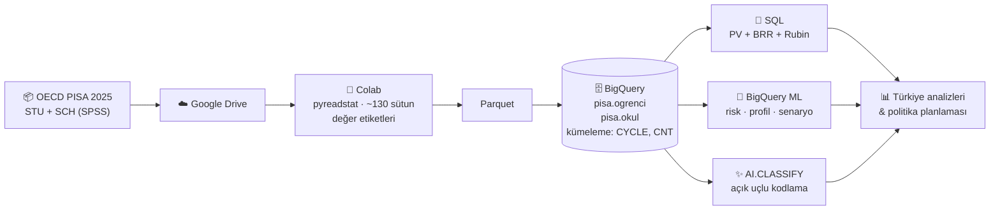

<div align="center">

# PISA 2025 × BigQuery × Makine Öğrenmesi

### Büyük Ölçekli Eğitim Değerlendirmelerinde Öğrenci Başarısının BigQuery ve Makine Öğrenmesi Algoritmaları ile Analizi

**Zekeriya Beşiroğlu** · AI Architect · **İstanbul Data Science Academy**


*X. Uluslararası Eğitimde ve Psikolojide Ölçme ve Değerlendirme Kongresi (CMEEP 2026)*<br>
*Çalıştay 14 · 9 Ekim 2026 · Pamukkale Üniversitesi & EPODDER*

</div>

---

> **English summary.** An end-to-end, reproducible pipeline that loads the OECD **PISA 2025** student and school files into **Google BigQuery** and analyses them with plain SQL. It computes design-correct estimates with 10 plausible values, 80 Fay BRR replicate weights and Rubin's rules, and runs in-warehouse machine learning with **BigQuery ML** for risk prediction, student profiling, scenario simulation and school-level early warning. The study has a special focus on Türkiye. It was designed and built by **Zekeriya Beşiroğlu (AI Architect, İstanbul Data Science Academy)** for the CMEEP 2026 workshop.

---

## İçindekiler

- [Bu çalışma ne yapıyor?](#bu-çalışma-ne-yapıyor)
- [Mimari](#mimari)
- [Hızlı başlangıç](#hızlı-başlangıç)
- [Repo yapısı](#repo-yapısı)
- [Analiz kataloğu](#analiz-kataloğu)
- [Yöntem: doğru istatistik](#yöntem-doğru-istatistik)
- [PISA 2025: Türkiye'ye bakış](#pisa-2025-türkiyeye-bakış)
- [Sınırlılıklar ve etik](#sınırlılıklar-ve-etik)
- [Atıf](#atıf)
- [Hazırlayan](#hazırlayan)

---

## Bu çalışma ne yapıyor?

PISA gibi büyük ölçekli değerlendirmeler yüz binlerce öğrenci ve binlerce değişken içerir. Doğru bir standart hata için tek bir istatistik bile **10 olası değer × 81 ağırlık = 810 kez** hesaplanmalıdır. Masaüstü araçlar bu ölçekte zorlanır.

Bu çalışma bu yükü sunucusuz bir veri ambarına taşır:

| | |
|---|---|
| 🗄️ **Büyük veri** | PISA 2025 öğrenci ve okul dosyaları BigQuery'de kümelenmiş tablolar olarak tutulur |
| 📐 **Doğru istatistik** | Olası değerler, Fay BRR tekrarlı ağırlıkları ve Rubin kuralları tek bir SQL sorgusunda |
| 🇹🇷 **Türkiye derinlemesine** | Cinsiyet, sosyoekonomik düzey, okul türü, tabaka, yerleşim yeri, okullar arası fark |
| 🤖 **Makine öğrenmesi** | BigQuery ML ile lojistik regresyon, gradyan artırmalı ağaç ve k-ortalamalar; veri ambardan çıkmaz |
| 🔭 **Geleceğe dönük planlama** | "Ne olurdu?" senaryoları, okul düzeyinde erken uyarı, 2029 senaryoları |
| ✨ **Üretken YZ** | `AI.CLASSIFY` ile açık uçlu yanıt kodlama ve uzman–YZ uyumu (Cohen kappa) |

---

## Mimari



---

## Hızlı başlangıç

**Gereksinimler:** bir Google hesabı ve bir Google Cloud projesi. **BigQuery sandbox** yeterlidir; kredi kartı gerekmez, ayda 1 TiB sorgu ve 10 GiB depolama ücretsizdir.

**1 · Veriyi edinin**
OECD PISA 2025 veri tabanından **öğrenci (STU)** ve **okul (SCH)** anket dosyalarının **SPSS** sürümünü indirin ve Google Drive'ınıza yükleyin.

> ⚠️ PISA veri dosyaları bu repoda **yer almaz**. `.gitignore` bunların yanlışlıkla eklenmesini engeller.

**2 · BigQuery'ye yükleyin**
[`notebooks/01_pisa_bigquery_yukle.ipynb`](notebooks/01_pisa_bigquery_yukle.ipynb) defterini Google Colab'de açın, `PROJE_ID` değerini yazın ve **Tümünü çalıştır**'a basın. Defter şunları yapar:
- Drive'daki STU ve SCH dosyalarını kendisi bulur.
- 2025'te adı değişmiş değişkenleri raporlar.
- Okul türü ve tabaka etiketlerini ayrı sütunlara yazar.
- Veriyi `pisa.ogrenci` ve `pisa.okul` tablolarına yükler.

**3 · Doğrulayın**
[`sql/02_ulke_ortalamalari.sql`](sql/02_ulke_ortalamalari.sql) dosyasını BigQuery konsolunda çalıştırın. Türkiye için resmi raporla aynı değerler çıkmalı: **matematik 462 · okuma 472 · fen 494**.

**4 · Analiz edin**
`sql/` klasöründeki dosyaları sırayla çalıştırın. Adım adım demo akışı için: [`docs/DEMO_REHBERI.md`](docs/DEMO_REHBERI.md)

---

## Repo yapısı

```
pisa2025-bigquery-ml/
├── notebooks/
│   └── 01_pisa_bigquery_yukle.ipynb   # Drive → Colab → BigQuery yükleme
├── sql/
│   ├── 01–05   Temel: kontrol, ortalamalar, standart hata, ESCS, yeterlik düzeyleri
│   ├── 06–08   BigQuery ML: risk modeli, ülkeler arası sınama, k-ortalamalar
│   ├── 09      Üretken YZ: AI.CLASSIFY ile açık uçlu kodlama (isteğe bağlı)
│   ├── 10–13   Türkiye derinlemesine: cinsiyet, okul türü, okullar, yerleşim yeri
│   └── 14–16   Planlama: senaryo simülasyonu, erken uyarı, 2029 projeksiyonu
├── docs/
│   └── DEMO_REHBERI.md                 # Hazırlık, demo akışı, sorun giderme
├── CITATION.cff
├── LICENSE
└── README.md
```

---

## Analiz kataloğu

### 📐 Temel analizler

| Dosya | Soru | Yöntem |
|---|---|---|
| [`01_kontrol`](sql/01_kontrol.sql) | Veri doğru yüklendi mi? | Satır, ülke, temsil edilen nüfus |
| [`02_ulke_ortalamalari`](sql/02_ulke_ortalamalari.sql) | Ülkeler üç alanda nerede? | 10 PV, çok sütunlu `UNPIVOT` |
| [`03_standart_hata`](sql/03_standart_hata.sql) | Tahmin ne kadar kesin? | 810 tahmin, Fay BRR + Rubin |
| [`04_escs_gruplari`](sql/04_escs_gruplari.sql) | Başarı sosyoekonomik düzeye göre nasıl değişiyor? | ESCS grupları, nüfus payları |
| [`05_yeterlik_duzeyleri`](sql/05_yeterlik_duzeyleri.sql) | Kaç öğrenci temel yeterliğin altında, kaçı üst düzeyde? | Düzey 2 altı / Düzey 5+ |

### 🇹🇷 Türkiye derinlemesine

| Dosya | Soru |
|---|---|
| [`10_turkiye_cinsiyet`](sql/10_turkiye_cinsiyet.sql) | Kız–erkek farkı anlamlı mı? Farkın kendi standart hatasıyla |
| [`11_turkiye_program_bolge`](sql/11_turkiye_program_bolge.sql) | Okul türü (PROGN) ve örneklem tabakasına (STRATUM) göre başarı |
| [`12_okullar_arasi_fark`](sql/12_okullar_arasi_fark.sql) | Başarı farkının ne kadarı okullar arasında? |
| [`13_okul_konum_turu`](sql/13_okul_konum_turu.sql) | Köyden büyükşehre ve devlet–özel okul farkları |

### 🤖 Makine öğrenmesi (BigQuery ML)

| Dosya | Model | Amaç |
|---|---|---|
| [`06_model_risk`](sql/06_model_risk.sql) | `LOGISTIC_REG`, `BOOSTED_TREE_CLASSIFIER` | Matematikte Düzey 2 altında kalma riskini tahmin, açıklanabilirlik |
| [`07_ulkeler_arasi_aktarim`](sql/07_ulkeler_arasi_aktarim.sql) | Ağaç modeli | Türkiye'de öğren, başka ülkelerde sına; belirleyiciler aynı mı? |
| [`08_kmeans_profiller`](sql/08_kmeans_profiller.sql) | `KMEANS` | Denetimsiz öğrenci profilleri ve başarıları |

### 🔭 Geleceğe dönük planlama

| Dosya | Araç |
|---|---|
| [`14_senaryo_simulasyonu`](sql/14_senaryo_simulasyonu.sql) | Aidiyet, kaygı, öz-yeterlik, sınıf tekrarı ve dezavantajlılara destek senaryolarında risk oranı |
| [`15_okul_erken_uyari`](sql/15_okul_erken_uyari.sql) | Okul düzeyinde risk ve yoğunlaşma: hedefli destek mi, sistem geneli politika mı? |
| [`16_trend_projeksiyon_2029`](sql/16_trend_projeksiyon_2029.sql) | PISA 2029 için üç senaryo ve belirsizlik aralığı |

---

## Yöntem: doğru istatistik

PISA puanları tek bir test puanı değil, her öğrenci için **10 olası değerdir (PV)**. Örneklem de karmaşık bir tasarımla seçildiği için standart hata **80 tekrarlı ağırlıkla** hesaplanır. Bu çalışma her ikisini de SQL içinde uygular:

**1.** Her olası değer $i$ için tam ağırlıkla tahmin: $\hat\theta_i$

**2.** Örnekleme varyansı (Fay BRR, $k = 0{,}5$, $G = 80$):

$$U_i = \frac{1}{G(1-k)^2}\sum_{r=1}^{80}\left(\hat\theta_{i,r} - \hat\theta_i\right)^2 = \frac{1}{20}\sum_{r=1}^{80}\left(\hat\theta_{i,r} - \hat\theta_i\right)^2$$

**3.** Ölçme varyansı (olası değerler arası):

$$B = \frac{1}{M-1}\sum_{i=1}^{M}\left(\hat\theta_i - \bar\theta\right)^2, \quad M = 10$$

**4.** Rubin kuralıyla birleştirme:

$$V = \bar U + \left(1 + \frac{1}{M}\right) B, \qquad SH = \sqrt{V}$$

BigQuery'de olası değerler ve ağırlıklar `UNNEST … WITH OFFSET` ile satırlara açılır ve ülke başına 810 tahmin **tek sorguda, paralel** hesaplanır. Aynı kalıp cinsiyet farkı, okul türü ve tabaka gibi tüm grup karşılaştırmalarında kullanılır.

> ✅ Hesaplama sorguları PISA dosya yapısını taklit eden sentetik veriyle test edildi. Ortalamalar, standart hatalar, cinsiyet farkı, okullar arası varyans payı ve yeterlik yüzdeleri bağımsız numpy hesaplarıyla birebir aynı sonucu verdi.

---

## PISA 2025: Türkiye'ye bakış

| Alan | Türkiye | OECD ort. | Tüm ülkeler | 2022'ye göre | OECD sırası |
|---|:-:|:-:|:-:|:-:|:-:|
| **Fen** *(ağırlıklı alan)* | **494** | 482 | 443 | +18 | 14 / 38 |
| **Okuma** | **472** | 461 | 420 | +16 | 13 / 38 |
| **Matematik** | **462** | 463 | 429 | +9 | 23 / 38 |

<sub>Kaynak: MEB, PISA 2025 Türkiye sonuçları (8 Eylül 2026). Türkiye'den 56 ilde 203 okuldan 7.702 öğrenci katılmıştır; uygulamaya 91 ülke ve ekonomi katılmıştır.</sub>

Türkiye 2025'te fen ve okumada OECD ortalamasının üzerine çıktı; matematikte OECD ortalamasıyla neredeyse eşit. Bu repodaki sorgular bu tabloyu mikro veriden yeniden üretir ve ötesine geçer: **farkın kimlere yaradığını, okullar arasında nasıl dağıldığını ve 2029'a nasıl planlanabileceğini** sorgular.

---

## Sınırlılıklar ve etik

- **İl düzeyi:** Kamuya açık PISA dosyasında il bilgisi yoktur ve örneklem il düzeyinde temsili değildir. İl ve okul düzeyinde karar için aynı akış ulusal verilerle (ABİDE, LGS vb.) kullanılmalıdır.
- **Nedensellik:** Değişken önemi ve senaryo simülasyonları **nedensel etki değildir**. Bunlar, öğrenilen ilişkiler sabit kalırsa ne olacağını gösterir. Politikayı önceliklendirmeye yarar, kanıtlamaz.
- **Ağırlıklar ve ML:** BigQuery ML bu modellerde örneklem ağırlığı kullanmaz. Model sonuçları keşifseldir, nüfus kestirimi değildir.
- **2029 projeksiyonu:** 8 noktalık bir seride belirsizlik ±24–33 puandır. Sonuç bir kehanet değil, hedef aralığıdır.
- **Okul erken uyarısı:** PISA'da okul kimlikleri anonimdir. Yöntem, okulları etiketlemek için değil kaynak yönlendirmek için tasarlanmıştır.
- **Üretken YZ:** `09` dosyasındaki öğrenci yanıtları demo amaçlı uydurulmuş örneklerdir. YZ kodlaması uzman kontrolü ve uyum istatistiği olmadan kullanılmamalıdır.

---

## Atıf

Bu çalışmayı kullanırsanız lütfen şöyle atıf verin:

> Beşiroğlu, Z. (2026). *Büyük Ölçekli Eğitim Değerlendirmelerinde Öğrenci Başarısının BigQuery ve Makine Öğrenmesi Algoritmaları ile Analizi* [Yazılım ve çalıştay materyali]. İstanbul Data Science Academy. CMEEP 2026, Çalıştay 14, Denizli.

```bibtex
@misc{besiroglu2026pisa,
  author       = {Beşiroğlu, Zekeriya},
  title        = {Büyük Ölçekli Eğitim Değerlendirmelerinde Öğrenci Başarısının
                  BigQuery ve Makine Öğrenmesi Algoritmaları ile Analizi},
  year         = {2026},
  publisher    = {İstanbul Data Science Academy},
  note         = {CMEEP 2026 -- X. Uluslararası Eğitimde ve Psikolojide Ölçme ve
                  Değerlendirme Kongresi, Çalıştay 14, Denizli}
}
```

GitHub, repo sayfasındaki **"Cite this repository"** düğmesini [`CITATION.cff`](CITATION.cff) dosyasından otomatik oluşturur.

**Veri kaynağı:** OECD (2026), *PISA 2025 Database*. PISA verileri OECD'ye aittir ve OECD'nin kullanım koşullarına tabidir.

---

## Hazırlayan

<table>
<tr>
<td>

**Zekeriya Beşiroğlu**<br>
AI Architect<br>
**İstanbul Data Science Academy**

Bu çalışmanın tasarımı, veri mühendisliği akışı, SQL analizleri, makine öğrenmesi modelleri ve çalıştay materyali Zekeriya Beşiroğlu tarafından İstanbul Data Science Academy adına hazırlanmıştır.

<!-- İletişim bağlantılarınızı buraya ekleyin, örn.:
[LinkedIn](https://www.linkedin.com/in/...) · [Web](https://...) -->

</td>
</tr>
</table>

**Çalıştay:** CMEEP 2026 · Çalıştay 14 · Prof. Dr. Nuri Doğan ve Zekeriya Beşiroğlu<br>
**Düzenleyenler:** Pamukkale Üniversitesi · Eğitimde ve Psikolojide Ölçme ve Değerlendirme Derneği (EPODDER)

---

<div align="center">

**© 2026 Zekeriya Beşiroğlu · İstanbul Data Science Academy**<br>
<sub>Kod MIT lisansıyla paylaşılmıştır. PISA verileri OECD'ye aittir ve bu repoda yer almaz.</sub>

</div>
